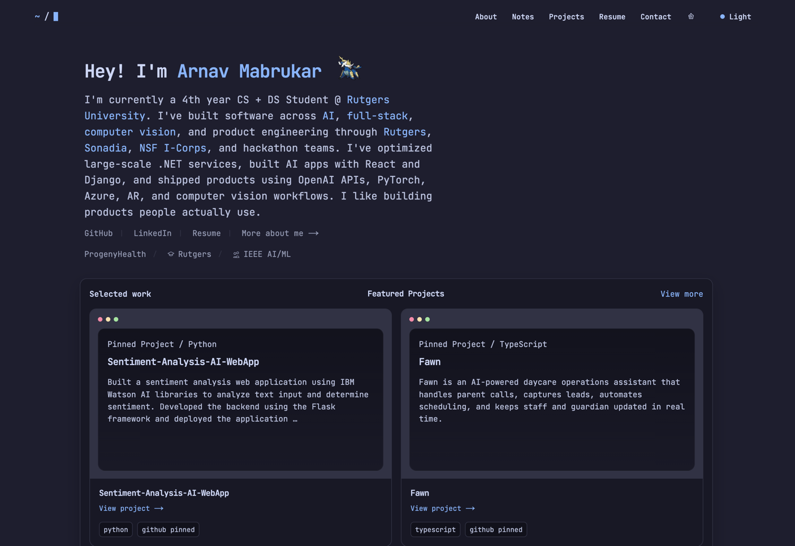

# Arnav's Portfolio

Live site:  
https://arnavmabrukar.vercel.app



This is my personal portfolio website.

It was built to be clean, minimal, and easy to navigate, with a focus on showing my projects, background, resume, and current work in a simple way.

## Built With

- Next.js
- React
- TypeScript
- CSS
- Vercel Analytics

## File Structure

```text
app/
  layout.tsx       App layout, metadata, fonts, analytics
  page.tsx         Main homepage content
  globals.css      Styling and responsive layout
  robots.ts        Robots.txt generation
  sitemap.ts       Sitemap generation

components/
  appearance-card.tsx
  resume-card.tsx
  theme-toggle.tsx
  topbar-breadcrumb.tsx

public/
  arnav-portrait.png
  Arnav_Mabrukar_Resume.pdf
  pokeball-pixel.svg
```

## Main Areas

- Intro / hero section
- Featured projects
- Profile and contact area
- Resume preview and download
- Appearance settings
- Experience highlights
- Recent GitHub activity

## Notes

- Main content is mostly in `app/page.tsx`
- Styling is mostly in `app/globals.css`
- The site is meant to be deployed on Vercel
